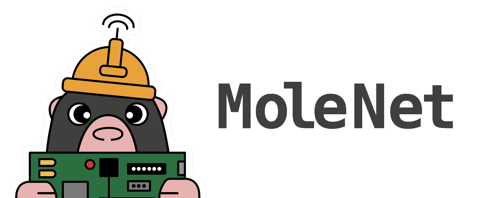

# MoleNet: A Wireless Underground Sensor Network Platform

**MoleNet** is a versatile Wireless Underground Sensor Network (WUSN) platform designed for education and low-power environmental monitoring.  
This repository contains all relevant resources, including PCB layouts, source code, and examples to test and evaluate the platform.

Further information can be found on the official [MoleNet Website](https://molenet.org/)!

> ⚠️ **Note:** This is an active project. The files and directory structure are subject to change.

## New ESP32-based MoleNet!

After a long journey, we are finally at a point where we are testing the current version on a larger scale.  
The latest version of MoleNet features several key improvements:

- **ESP32-S3 microcontroller**: A powerful yet energy-efficient processor that supports various development ecosystems including [MicroPython](https://micropython.org/), [Arduino](https://www.arduino.cc/), and [RiotOS](https://www.riot-os.org/)
- **SDI-12 sensor interface**: Compatible with high-quality environmental sensors
- **Micro-SD card support**: Enables extensive local data storage
- **SX1276-based LoRa transceiver**: Provides long-range wireless communication
- **On-board BME280 sensor**: Measures temperature, barometric pressure, and humidity [BME280](https://www.bosch-sensortec.com/products/environmental-sensors/humidity-sensors-bme280/)
- **Low-power design**: Ensures long battery life for extended deployments
- **qwiic connectivity**: Simplifies integration of I2C-based sensors, as, for
  example, available here: [Sparkfun](https://www.sparkfun.com/qwiic)

## Older Versions

Documentation for the ATMEGA-based MoleNet boards can be found in the [documentation directory](docs/MoleNet_ATMEGA.md).

## Changelog

The list of changes and the evolution of MoleNet is listed in the
[changelog](CHANGELOG.md).

## Publications

The following list gives some MoleNet-related publicationsThe following list
gives some MoleNet-related publications:

- Gellhaar, M., Dede, J., Koehler, H., & Förster, A. (2016). Design and Evaluation of Underground Wireless Sensor Networks for Reforestation Monitoring.
- Zaman, I., Dede, J., Gellhaar, M., Koehler, H., & Foerster, A. (2016). Molenet: A new sensor node for underground monitoring. IEEE SenseApp.
- I. Zaman, M. Gellhaar, J. Dede, H. Koehler and A. Foerster, "Demo: Design and Evaluation of MoleNet for Wireless Underground Sensor Networks," 2016 IEEE 41st Conference on Local Computer Networks Workshops (LCN Workshops), Dubai, United Arab Emirates, 2016, pp. 145-147, doi: 10.1109/LCN.2016.040.
- J. Dede, D. Helms, and A. Förster, “MoleNet: An Underground Sensor Network for Soil Monitoring”, ECEASST, vol. 80, Sep. 2021.
- Damien Wohwe Sambo, Jens Dede, Nathalie Mitton, Anna Förster. FuzDeMa: A portable Fuzzy-based Decision-Making tool for reliable communication in Wireless Underground Sensor Networks. ITU Journal on Future and Evolving Technologies, 2023, 4 (3), pp.419-433. ⟨10.52953/IXIP2995⟩.

## Contributors

Many students and researchers contribute to the MoleNet project.  
See the full list of contributors in [CONTRIBUTORS.md](CONTRIBUTORS.md).
